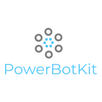

# PowerBotKit

<p align="center">
  
  <br>
  <i>
    PowerBotKit is a bot development framework to help developer to quickly build enterprise ready chat-bot solution, it based on <a href="https://github.com/Microsoft/botbuilder-js">botbuilder-js</a>, developed in a <a href="https://en.wikipedia.org/wiki/Monorep">monorepo</a>.
 </i>
</p>

<p align="center">
  <a href="https://www.npmjs.com/package/@powerbotkit/core">
    
  </a>&nbsp;
</p>

## Contents

- [What is powerbotkit](#what-is-powerbotkit)
- [QuickStart](#QuickStart)
- [DevelopGuide](#DevelopGuide)
- [TODO](#todo)
- [Contributing](#Contributing)

## What is PowerBotKit

`PowerBotKit` is a bot framework developed by PowerBotKit Team. It helps developers to build the chatbot solution on different BOT platform(for example, [Teams](https://teams.microsoft.com/), [Slack](https://slack.com/), [Workspace](https://www.workplace.com/)). It is framework with high performance and easy to scaled.

Find more details from the [PowerBotKit website](https://powerbotkit.github.io)

[WIP] The key capability that PowerBotKit can offer is

-
-

We use [yarn](https://classic.yarnpkg.com/) to bootstrap the project and use [lerna](https://lerna.js.org/) to run the publish command(s).

## QuickStart

### Install

1. You need to set up 2 projects, one is for distributor (producer), another is for consumer

2. In your distributor project, run below

```shell
$ npm install @powerbotkit/distributor # yarn add @powerbotkit/distributor
```

3. Use below code snippet to quickly set up your bot distriubtor

```typescript
import { createDistributorServer, TBotConfig } from '@powerbotkit/distributor';

(async () => {
  const config: TBotConfig = {
    appId: '',
    appSecret: ''
  };
  const server = await createDistributorServer(config);
  server.listen();
})();
```

4. In your consumer project, run below

```shell
$ npm install @powerbotkit/consumer # yarn add @powerbotkit/consumer
```

## DevelopGuide

WIP

## TODO

this is [todo list](https://github.com/orgs/PowerBotKit/projects/1)

## Contributing

`powerbotkit` is the open source project. it is on developing. So we would love for you to contribute to `powerbotkit` and help make it even better than it is today!. Before submitting your contribution, please make sure to take a moment and read [contribution guide](https://github.com/PowerBotKit/powerbot/blob/develop/CONTRIBUTING.md)

## License

[MIT](LICENSE) © PowerBotKit Team

## Thanks

thanks for [jetbrains](https://www.jetbrains.com/) support.
